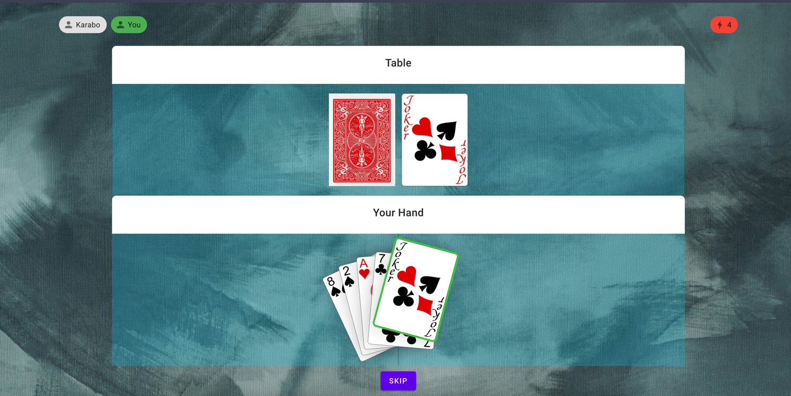

## Crazy 8 Card Game

### Overview

Welcome to the Crazy 8 Card Game! This project is a digital rendition of the popular card game widely enjoyed in South 
Africa. Built using `C#` with `.NET 7.0`, `Blazor Server`, `MatBlazor`, and `SignalR`, this game allows you to play 
Crazy 8 with friends regardless of geographical distances. I developed this game to reconnect and enjoy some fun times 
with my friends who live in different cities. I hope you find this project as exciting as I do. Contributions and 
collaborations are more than welcome!


### Technologies Used

- **C# .NET 7.0**: The core language and framework used for building the backend.
- **Blazor Server**: The front-end framework for building interactive web UIs using C#.
- **MatBlazor**: A Material Design component library for Blazor.
- **SignalR**: A library for adding real-time web functionality, such as live updates and notifications.

### Features

- **Real-time Gameplay**: Thanks to SignalR, players can enjoy a seamless real-time experience.
- **Interactive UI**: Built with MatBlazor, the user interface is both intuitive and visually appealing.
- **Multiplayer Support**: Play Crazy 8 with friends from different locations.

### Getting Started

#### Prerequisites

- .NET 7.0 SDK
- Visual Studio, VS Code or Rider

#### Installation

1. **Clone the repository**:
    ```bash
    git clone https://github.com/karabomatabane/Crazy8Web.git
    cd Crazy8Web
    ```

2. **Restore the dependencies**:
    ```bash
    dotnet restore
    ```

3. **Build the project**:
    ```bash
    dotnet build
    ```

4. **Run the project**:
    ```bash
    dotnet run
    ```

5. **Access the game**:
   Open your browser and navigate to `https://localhost:7179` to start playing the game.

### Backend Library

There is a .NET 7.0 library that contains the backend logic of the game without a client. You can find the library [here](https://github.com/karabomatabane/Crazy8.git).

### Contributions

Contributions are more than welcome! Whether it's bug fixes, new features, or improvements, feel free to fork the repository and open a pull request. Let's make this game better together!

If you're interested in collaborating, please email me at karaboramakau@gmail.com. Let's build something amazing together!

### Contact

- **Email**: karaboramakau@gmail.com

### License

This project is not yet licensed.

---

Enjoy playing Crazy 8 and happy coding!